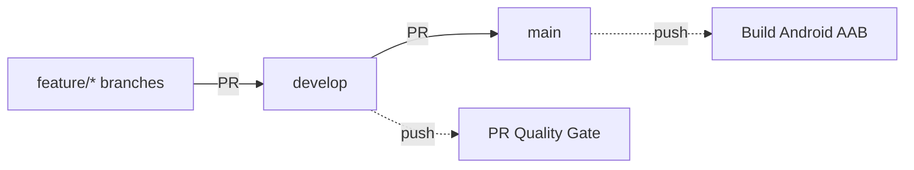

# Stylish E-commerce — React Native

A **React Native CLI** application for browsing, discovering, and purchasing products with a smooth mobile shopping experience. The project focuses on real-world app structure, reusable UI, Storybook documentation, and unit testing.

---

## Target

- Set up a reliable **Android/iOS** development environment.
- Understand **navigation** in React Native application (React Navigation v7).
- Understand and apply **core React Native building blocks** to real screens.
- Build **reusable components** and document them in **Storybook**.
- Write **meaningful unit tests** with comprehensive coverage.
- Practice **debugging** (DevTools) and consistent code quality.
- Implement **efficient data fetching** using TanStack Query.

---

## Features

### 🚀 Onboarding & Authentication

- **Boot splash screen** with animated logo
- **Multi-step onboarding** with navigation dots
- **Sign In / Sign Up** with email/password validation (Zod)
- **Secure authentication** with JWT tokens
- **Auto-login** functionality with session persistence

### 🏠 Home & Discovery

- **Product banners** and trending items
- **Horizontal product lists** for featured products
- **Product cards** with images, names, prices, and ratings
- **Category navigation** and filtering
- **Deals and special offers** sections

### 🔍 Browse & Search

- **Advanced search** with real-time filtering
- **Product categories** and subcategories
- **Filter modal** with multiple criteria
- **Loading, empty, and error states** throughout the app
- **Infinite scrolling** for product lists

### 📱 Product Details

- **Image carousel** with multiple product photos
- **Detailed product information** (price, stock, rating, description)
- **Size selector** for clothing items
- **Similar products** recommendations
- **Product actions**: Add to Cart, Buy Now, Add to Wishlist

### 🛒 Cart & Wishlist Management

- **Shopping cart** with item management (add/remove/update quantity)
- **Cart persistence** across app sessions
- **Wishlist functionality** with heart icon toggle
- **Delivery information** display
- **Cart item calculations** (subtotal, shipping, taxes)

### 💳 Checkout Flow

- **Checkout Screen** for finalizing purchases
- **Payment method selection**
- **Order summary** review

### 👤 User Profile & Settings

- **User profile** management
- **Settings screen** with app preferences
- **Logout functionality** with session cleanup
- **Secure storage** for user data

### 🎨 UI/UX Features

- **Custom tab navigation** with floating cart button
- **Responsive design** for different screen sizes
- **Loading states** and skeleton screens
- **Error handling** with user-friendly messages
- **Smooth animations** and transitions

---

## Technical stacks

- 📱 **[React Native (CLI)](https://reactnative.dev/)** (v0.81) – Native mobile app framework (iOS/Android) powered by React
- ⚛️ **[React](https://react.dev/)** (v19) – Component model & rendering
- 🔥 **[TypeScript](https://www.typescriptlang.org/)** – Static typing for safer, scalable code
- 🧭 **[React Navigation](https://reactnavigation.org/)** (v7) – Stacks, tabs, and deep-linking
- 📡 **[TanStack Query](https://tanstack.com/query/latest)** (v5) – Async state management & data fetching
- 🐻 **[Zustand](https://zustand-demo.pmnd.rs/)** (v5) – specific Client state management
- 🛡️ **[Zod](https://zod.dev/)** – Schema validation
- 📚 **[Storybook](https://storybook.js.org/)** – Build & document UI components in isolation
- 🧪 **[Jest](https://jestjs.io/)** + **[@testing-library/react-native](https://testing-library.com/docs/react-native-testing-library/intro/)** – Unit & component testing
- 🧰 **[ESLint](https://eslint.org/)** + **[Prettier](https://prettier.io/)** – Linting & formatting
- 🦊 **[Husky](https://github.com/typicode/husky)** + **[lint-staged](https://github.com/lint-staged/lint-staged)** – Git hooks & staged-file linting
- 📝 **[Commitlint](https://commitlint.js.org/)** – Conventional commits for clean history
- 🗄️ **[Strapi v5](https://strapi.io/)** – Headless CMS / API provider
- 🧱 **Metro**, **CocoaPods** (iOS), **Azul Zulu JDK** (Android)

---

## Project Structure

```shell
src/
├── assets/                       # Static resources: images, icons, fonts
├── components/                   # Reusable UI components
│   ├── common/                   # Shared components (Button, FormField, etc.)
│   ├── ui/                       # Atomic UI components (extensive library)
│   ├── BottomTabHeader/          # Navigation headers
│   ├── GlobalHeader/             # App-wide header
│   ├── ToastContainer/           # Toast notification wrapper
│   └── ...
├── constants/                    # App constants: routes, endpoints, UI constants
├── contexts/                     # React Context definitions (e.g., QueryClient)
├── enums/                        # TypeScript enums for app logic
├── helpers/                      # Pure utility functions: formatters, validators
├── hooks/                        # Custom React hooks (useAuthActions, useCart, etc.)
├── icons/                        # SVG icon components
├── interfaces/                   # TypeScript type definitions
├── mocks/                        # Mock data for development and testing
├── navigation/                   # React Navigation setup (v7)
├── schemas/                      # Zod validation schemas
├── screens/                      # Page-level screens
│   ├── OnboardingScreen/         # App introduction
│   ├── LoginScreen/              # Authentication
│   ├── HomeScreen/               # Main dashboard
│   ├── ProductListScreen/        # Product browsing
│   ├── ProductDetailsScreen/     # Product details
│   ├── CartScreen/               # Shopping cart
│   ├── CheckoutScreen/           # Order finalization
│   ├── WishlistScreen/           # User wishlist
│   ├── SearchScreen/             # Product search
│   ├── SettingsScreen/           # User settings
│   └── RegisterScreen/           # User registration
├── services/                     # API services and data layer
│   ├── apiClient.ts              # Base API client with interceptors
│   ├── auth.ts                   # Authentication service
│   ├── products.ts               # Product-related API calls
│   ├── cart.ts                   # Cart management
│   └── wishlist.ts               # Wishlist operations
├── stores/                       # Zustand state management (auth, search, toast)
├── styles/                       # Global styles and themes
└── themes/                       # App theming configuration

backend/                          # Strapi v5 CMS backend
├── config/                       # Strapi configuration
├── src/                          # Strapi source code
│   ├── api/                      # API endpoints and controllers
│   ├── components/               # Strapi components
│   └── extensions/               # Strapi extensions
└── database/                     # Database migrations and seeds
```

---

## Testing & Quality Assurance

### 🧪 Test Coverage

The project maintains comprehensive test coverage:

- **Unit Tests** with Jest
- **Snapshot Tests** for UI components
- **Component Testing** with React Native Testing Library
- **Service Layer Testing** with mocked API responses
- **Hook Testing** for custom React hooks
- **Helper Function Testing** for utility functions

### 📚 Component Documentation

- **Storybook integration** for component documentation
- **Interactive component playground** for development
- **Visual regression testing** with snapshots
- **Component stories** for different states and props

### 🔧 Code Quality

- **ESLint** configuration for code linting
- **Prettier** for consistent code formatting
- **Husky** git hooks for pre-commit checks
- **TypeScript** strict mode for type safety
- **Zod** runtime validation for API responses

---

## CI/CD

GitHub Actions pipelines run on every PR and on `main` merges. **All workflows execute on `runs-on: ubuntu-latest`** (no self-hosted runners — required for public repository security per [GitHub Docs](https://docs.github.com/actions/hosting-your-own-runners/managing-self-hosted-runners/about-self-hosted-runners#self-hosted-runner-security)).

### Branch model (Git Flow)



- **`develop`** (default): integration branch. PRs require Quality Gate.
- **`main`**: release-ready code. Push triggers AAB build + signed artifact.

### Workflows

| Workflow                                                       | Trigger                                   | Purpose                                                                 |
| -------------------------------------------------------------- | ----------------------------------------- | ----------------------------------------------------------------------- |
| [`pr-quality-gate.yml`](.github/workflows/pr-quality-gate.yml) | PR → `develop`/`main`                     | Lint, prettier check, `tsc --noEmit`, Jest, dependency review, gitleaks |
| [`codeql.yml`](.github/workflows/codeql.yml)                   | PR/push to `develop`/`main` + weekly cron | CodeQL SAST (security + code-quality queries)                           |
| [`build-android.yml`](.github/workflows/build-android.yml)     | Push to `main` + `workflow_dispatch`      | `gradlew bundleRelease` → signed `.aab` artifact (30-day retention)     |
| [`bundle-analyze.yml`](.github/workflows/bundle-analyze.yml)   | PR (JS/TS files)                          | Source map explorer report                                              |

### Variables vs Secrets

**Variables** (`${{ vars.X }}`) — non-sensitive, plaintext, audit-friendly.
**Secrets** (`${{ secrets.X }}`) — encrypted, masked in logs.

| Name                          | Type     | Scope          | Purpose                                                                          |
| ----------------------------- | -------- | -------------- | -------------------------------------------------------------------------------- |
| `NODE_VERSION`                | Variable | Repo           | Node.js version (`20`)                                                           |
| `JAVA_VERSION`                | Variable | Repo           | JDK version (`17`)                                                               |
| `ANDROID_PACKAGE_NAME`        | Variable | Repo           | `com.reactnativetemplate`                                                        |
| `WITH_ROZENITE`               | Variable | Repo           | `false` — disable Rozenite devtools in CI bundle                                 |
| `API_BASE_URL`                | Variable | Env (dev/prod) | Backend API base URL                                                             |
| `STRAPI_BASE_URL`             | Variable | Env (dev/prod) | Strapi CMS base URL                                                              |
| `LOAD_STORYBOOK`              | Variable | Env (dev/prod) | Toggle on-device Storybook                                                       |
| `USES_CLEARTEXT_TRAFFIC`      | Variable | Env (dev/prod) | AndroidManifest cleartext flag                                                   |
| `ANDROID_KEYSTORE_BASE64`     | Secret   | Repo           | base64-encoded upload keystore (decoded to `android/app/release.keystore` in CI) |
| `ANDROID_KEYSTORE_PASSWORD`   | Secret   | Repo           | Store password                                                                   |
| `ANDROID_KEY_ALIAS`           | Secret   | Repo           | Key alias inside keystore                                                        |
| `ANDROID_KEY_PASSWORD`        | Secret   | Repo           | Key password                                                                     |
| `GOOGLE_SERVICES_JSON_BASE64` | Secret   | Repo           | base64-encoded `google-services.json` (FCM)                                      |

**`.env.production` is gitignored** and generated in CI from environment Variables. **`google-services.json` is gitignored** and restored from the secret at build time.

### How release signing works

CI writes `android/keystore.properties` and decodes the keystore to `android/app/release.keystore`, then runs `assembleRelease` / `bundleRelease`. In `android/app/build.gradle`, release signing uses that file when `keystore.properties` exists; local builds without that file keep using the debug keystore for release (as before).

### Runbook

#### Download a built AAB

```bash
gh run list --workflow=build-android.yml --limit 5
gh run download <run-id> -n android-release-aab-<run-number>-<sha>
```

The AAB can be uploaded manually to Play Console (Internal testing → Create new release).

#### Trigger a build manually

```bash
# Release APK + AAB (default)
gh workflow run build-android.yml --ref main

# Or choose debug APK only
gh workflow run build-android.yml --ref main -f build_type=debug
```

#### Rotate the upload keystore

1. Generate a new keystore: `keytool -genkeypair -v -keystore ~/upload-new.keystore ...`
2. Update 4 secrets:
   ```bash
   gh secret set ANDROID_KEYSTORE_BASE64 --body "$(base64 -i ~/upload-new.keystore)"
   gh secret set ANDROID_KEYSTORE_PASSWORD
   gh secret set ANDROID_KEY_ALIAS --body "<new-alias>"
   gh secret set ANDROID_KEY_PASSWORD
   ```
3. Note: the **first** AAB signed with a new key requires Play Console "Upload key reset" if the app already exists on Play.

#### Rotate the Firebase API key

The previous `google-services.json` was committed to git history (commits before the CI/CD setup). Rotate the API key in [Google Cloud Console → APIs & Services → Credentials](https://console.cloud.google.com/apis/credentials), restrict it to the app's package name + SHA-256, then update `GOOGLE_SERVICES_JSON_BASE64`.

#### Add a new environment variable to production builds

1. `gh variable set <NAME> --env production --body "<value>"`
2. Add the line to the `Generate .env.production` step in [`build-android.yml`](.github/workflows/build-android.yml).
3. Add the key to [`react-native-config.d.ts`](react-native-config.d.ts) for type safety.

### Build time expectations

- **First run** (cold cache): ~20–25 min
- **Subsequent runs** (warm Gradle + Yarn cache): ~8–12 min
- **`pr-quality-gate`**: ~3–5 min total (jobs run in parallel)

### Known limitations

- Self-hosted runners are not used (public-repo security). Switch to private repo if dedicated build infra is needed.
- iOS builds are out of scope for this CI setup.
- E2E tests with a real Android emulator are not configured (use [Firebase Test Lab](https://firebase.google.com/docs/test-lab) for device testing).
- Play Console upload is **manual** — download the AAB artifact and upload via the console UI.
- The `unit-test` job is currently `continue-on-error: true` while pre-existing failing tests are fixed; quality-gate ignores its result. Remove the flag after tests are healthy.

---

## Backend Integration

### 🗄️ Strapi v5 CMS

The app integrates with a **Strapi v5** backend that provides:

- **RESTful API** endpoints for products, users, carts, and wishlists
- **Authentication & authorization** with JWT tokens
- **Content management** for products, categories, and deals
- **File upload** capabilities for product images
- **Database seeding** with sample data
- **Admin panel** for content management

---

## Getting Started

> **Note**: Make sure you have completed the [Set Up Your Environment](https://reactnative.dev/docs/set-up-your-environment) guide before proceeding.

Step by step to get started this app at your location

## How to Run

### Prerequisites

Make sure you install packages with correct version below:

- [Node.js v20.0.0+](https://nodejs.org/en/download/package-manager)
- [React Native CLI](https://reactnative.dev/docs/environment-setup)
- [CocoaPods](https://cocoapods.org/) (for iOS)
- [Android Studio](https://developer.android.com/studio) (for Android)

### Backend Setup (Strapi)

```sh
# Navigate to backend directory
cd backend

# Install dependencies
npm install
# or
yarn install

# Start Strapi development server
npm run dev
# or
yarn dev

# The Strapi admin panel will be available at http://localhost:1337/admin
```

### Environment Configuration

Create environment files in the root directory:

```sh
# .env.development
API_BASE_URL=http://localhost:1337/api
STRAPI_URL=http://localhost:1337

# .env.production
API_BASE_URL=https://your-production-api.com/api
STRAPI_URL=https://your-production-api.com
```

- **Note:**
  - Please add `.env` files into root of project source code
  - The app integrates with a Strapi v5 backend for API services

### Get source code

| Command                                                                      | Action                    |
| :--------------------------------------------------------------------------- | :------------------------ |
| `git clone git@gitlab.asoft-python.com:hien.duong/react-native-training.git` | Clone Repository with SSH |
| `cd react-native-training`                                                   | Redirect to folder        |

### Frontend Commands

| Command              | Action                          | Port/Output             |
| :------------------- | :------------------------------ | :---------------------- |
| `yarn install`       | Install packages dependencies   | N/A                     |
| `yarn start`         | Start Metro bundler             | <http://localhost:8081> |
| `yarn android`       | Run on Android device/emulator  | Android                 |
| `yarn ios`           | Run on iOS simulator/device     | iOS                     |
| `yarn test:coverage` | Generate code coverage report   | Coverage report         |
| `yarn lint`          | Run ESLint code linting         | N/A                     |
| `yarn eslint:fix`    | Fix ESLint errors automatically | N/A                     |

### Custom Fonts

When you add or update custom fonts in the `src/assets/fonts/` directory, you need to link them to your native projects. After adding new font files, run the following command:

```sh
npx react-native-asset
```

This command will automatically configure the fonts for both Android and iOS platforms. You only need to run this command when you add new fonts or update existing ones.

> **Note:** After running this command, you may need to rebuild your app for the changes to take effect.

## Step 1: Start Metro

First, you will need to run **Metro**, the JavaScript build tool for React Native.

To start the Metro dev server, run the following command from the root of your React Native project:

```sh
# Using npm
npm start

# OR using Yarn
yarn start
```

## Step 2: Build and run your app

With Metro running, open a new terminal window/pane from the root of your React Native project, and use one of the following commands to build and run your Android or iOS app:

### Android

```sh
# Using npm
npm run android

# OR using Yarn
yarn android
```

### iOS

For iOS, remember to install CocoaPods dependencies (this only needs to be run on first clone or after updating native deps).

The first time you create a new project, run the Ruby bundler to install CocoaPods itself:

```sh
bundle install
```

Then, and every time you update your native dependencies, run:

```sh
bundle exec pod install
```

For more information, please visit [CocoaPods Getting Started guide](https://guides.cocoapods.org/using/getting-started.html).

```sh
# Using npm
npm run ios

# OR using Yarn
yarn ios
```

If everything is set up correctly, you should see your new app running in the Android Emulator, iOS Simulator, or your connected device.

This is one way to run your app — you can also build it directly from Android Studio or Xcode.

## Step 3: Modify your app

Now that you have successfully run the app, let's make changes!

Open `App.tsx` in your text editor of choice and make some changes. When you save, your app will automatically update and reflect these changes — this is powered by [Fast Refresh](https://reactnative.dev/docs/fast-refresh).

When you want to forcefully reload, for example to reset the state of your app, you can perform a full reload:

**Android**: Press the **R** key twice or select **"Reload"** from the **Dev Menu**, accessed via **Ctrl + M** (Windows/Linux) or **Cmd ⌘ + M** (macOS).
**iOS**: Press **R** in iOS Simulator.

## Congratulations! :tada:

You've successfully run and modified your React Native App. :partying_face:
